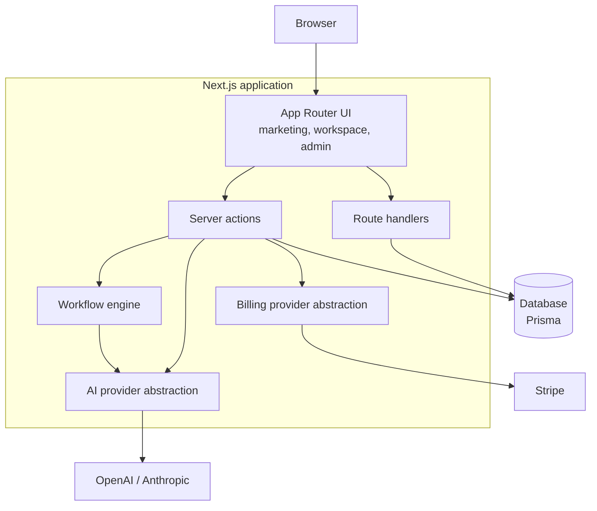
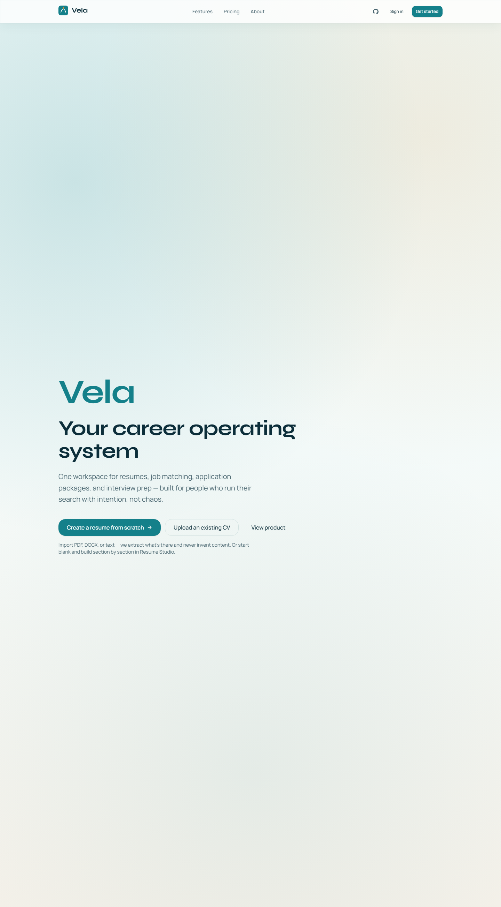
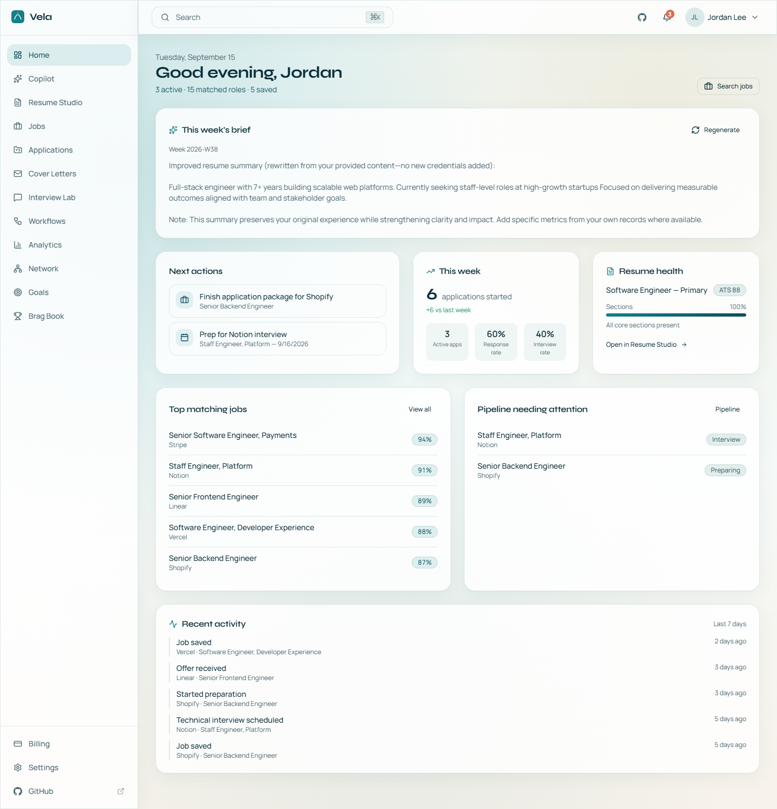
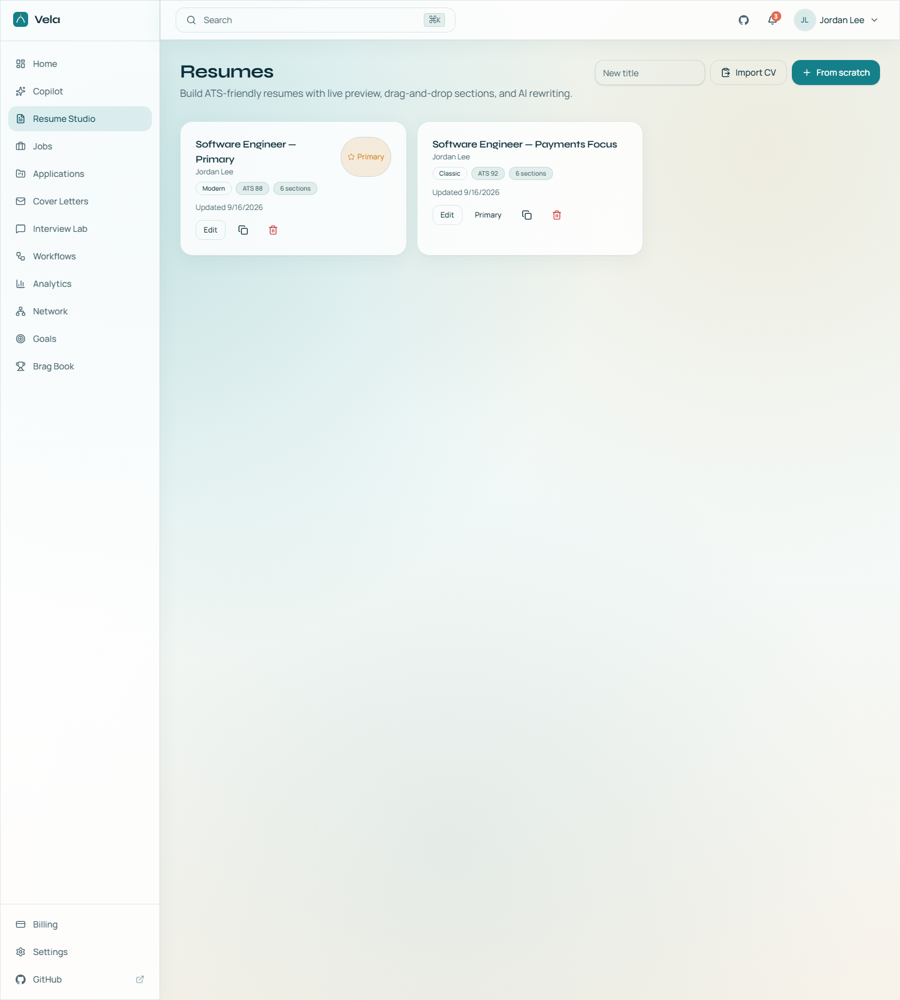
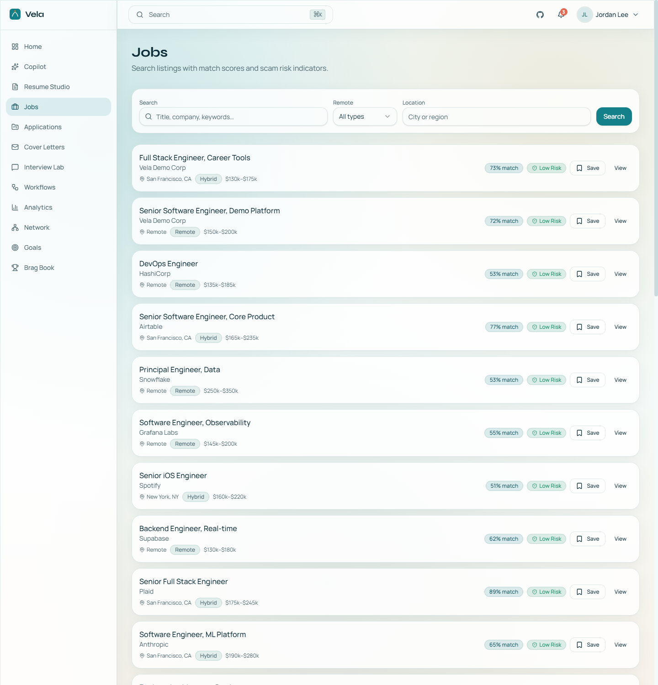
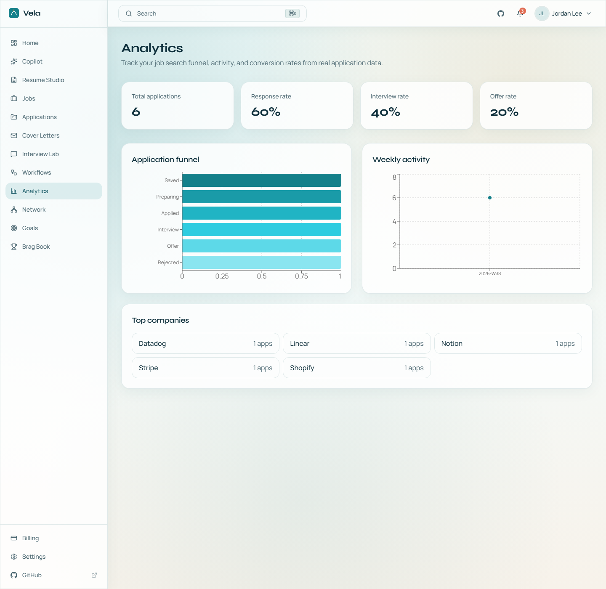
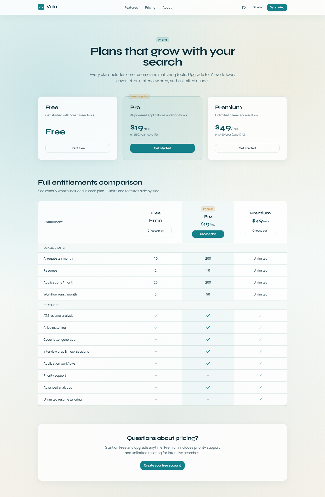
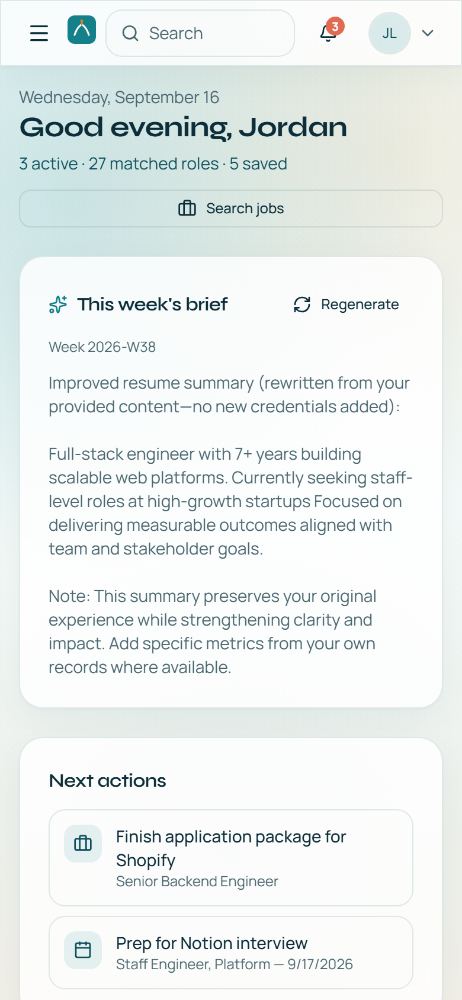
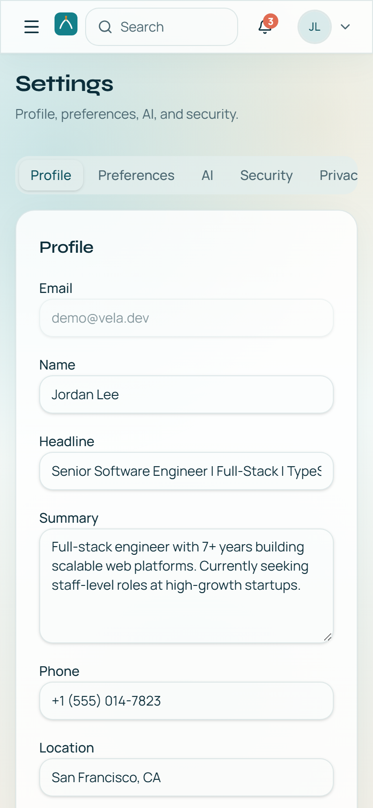
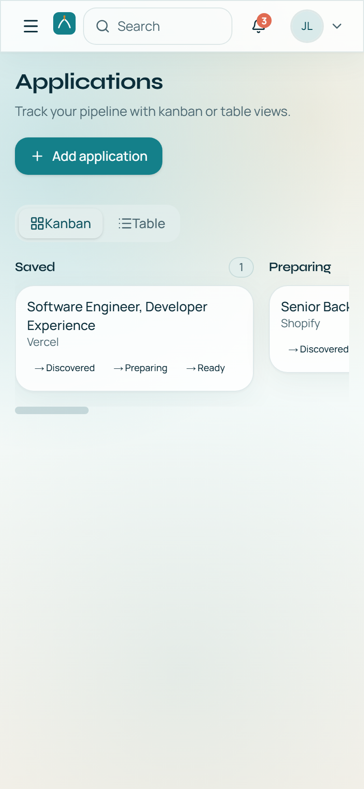

# Vela

> An AI-assisted career platform for building resumes, matching jobs, tracking applications, and preparing for interviews.

## Live Demo

**[Open the Vela demo](https://vela-career.onrender.com)**

The hosted demo runs with Vela's built-in mock AI and billing providers, so it needs no external API keys. Use the seeded accounts below.

| Email | Password | Role |
| ----- | -------- | ---- |
| `demo@vela.dev` | `DemoUser!2026` | User |
| `admin@vela.dev` | `VelaAdmin!2026` | Admin |

The demo database is ephemeral — it is recreated and reseeded on each deploy, so it is safe to experiment freely. All seeded people, companies, and jobs are fictional.

> The demo runs on a free-tier instance. The first request after a period of inactivity can take up to a minute while the service wakes.

## Overview

Vela is a career workspace that treats a job search as a pipeline rather than a pile of documents. It combines resume authoring, job discovery with explainable match scoring, an application tracker, interview preparation, and an AI copilot behind a single account and entitlement model.

The product is built around one deliberate constraint: **Vela prepares and explains; a human decides and submits.** The apply workflow runs through explicit review gates and stops at a manual submission step. Vela does not automate browser submission to job boards, and the interface says so rather than implying otherwise.

## Features

| Area | Capabilities |
| ---- | ------------ |
| **Resume Studio** | Structured content model, live preview, versioning, ATS scoring, PDF and JSON export, PDF/DOCX/TXT import with extraction preview |
| **Jobs** | Search, save, and match scoring with human-readable reasons and concerns, plus scam-risk signals |
| **Applications** | Kanban pipeline across discovered → applied → interview → offer, with an event timeline and follow-up dates |
| **AI Copilot** | Resume bullets, cover letters, interview prep, and match explanations behind a provider abstraction |
| **Workflows** | Multi-step apply pipeline with human review gates and an explicit manual-submission handoff |
| **Interview Lab** | Prep sessions, mock interviews, question banks, and STAR-structured answers |
| **Career tools** | Brag book, networking notes, career goals, and an analytics dashboard |
| **Billing** | Free / Pro / Premium tiers with database-backed entitlements and a Stripe-ready checkout path |
| **Admin console** | Users, plans, jobs, workflows, feature flags, AI settings, system configuration, and audit logs |

## Technology

- **Framework:** Next.js 15 (App Router), React 19, TypeScript 5
- **UI:** Tailwind CSS 4, Radix UI primitives, Recharts, lucide-react
- **Data:** Prisma 6 with a SQLite development database and a PostgreSQL-ready schema
- **Auth:** Auth.js v5 (NextAuth) with credentials sign-in and JWT sessions
- **AI:** Vercel AI SDK abstraction over mock, OpenAI, and Anthropic providers
- **Billing:** Stripe provider with a database-backed mock provider for local work
- **Validation:** Zod at every trust boundary
- **Testing:** Vitest for units, Playwright for end-to-end journeys
- **Tooling:** pnpm, ESLint, Prettier, GitHub Actions

## Architecture

Vela runs as a single Next.js deployment. The UI, server actions, route handlers, and workflow engine share one process, which keeps authorization and data access in one place rather than splitting trust across services.

Two boundaries are worth calling out. The **AI provider abstraction** means the same feature code runs against canned mock output, OpenAI, or Anthropic, selected by configuration. The **billing provider abstraction** does the same for entitlements, so the product is fully explorable without payment credentials. Both are what let the public demo run with no secrets at all.

The production implementation is maintained in a private source repository. This public repository is a portfolio and case-study presentation, not a source mirror.

## Screenshots

All captured from the live demo.

**Marketing site**

**Dashboard** — the weekly AI brief, live match scores, pipeline attention, and resume health.

**Resume Studio** — per-resume ATS scoring, section coverage, and template variants.

**Jobs** — match scoring with readable reasons and concerns, plus scam-risk signals.

**Analytics** — funnel, response rate, and interview rate derived from the application pipeline.

**Pricing** — Free, Pro, and Premium tiers backed by database entitlements.

**On mobile** — the workspace is responsive down to a 390px viewport: drawer navigation, stacked cards, and horizontally scrollable tab strips. Verified with zero horizontal overflow across all 16 application routes.

| Dashboard | Settings | Applications |
| :---: | :---: | :---: |
|  |  |  |

## Engineering Highlights

- **Explainable matching.** Match scoring returns reasons and concerns rather than a bare percentage, so a score can be argued with instead of trusted blindly.
- **Human-in-the-loop by design.** The workflow engine has a first-class `AWAITING_REVIEW` state. The apply step prepares a submission package and marks manual submission as required — it is structurally incapable of silently submitting.
- **Fail-closed authorization.** Every server action re-derives the session and tenant scope. Admin routes are gated on role, and admin data access is separated from user data access.
- **Entitlements as data.** Plan limits live in the database and are checked at the action layer, so plan changes do not require a redeploy.
- **Provider seams instead of provider lock-in.** AI and billing sit behind interfaces, which keeps vendor-specific behavior isolated and keeps the demo runnable without credentials.
- **A schema that survives the SQLite-to-PostgreSQL move.** Enum, JSON, and relation choices were made to map cleanly onto PostgreSQL so development and production do not diverge.

## Project Status

**Active development.** The application builds, runs, and is exercised by unit and end-to-end test suites. Core journeys — onboarding, resume editing and export, job matching, application tracking, and interview prep — are functional end to end.

The public demo runs in mock AI and billing mode. Enabling live OpenAI/Anthropic and Stripe requires operator-supplied credentials and is intentionally not represented as complete in the demo.

## Deployment

The application deploys as a single Node web service.

- **Application:** Render web service running the Next.js server, health-checked on `/api/health`
- **Database:** SQLite with an ephemeral filesystem for the demo; PostgreSQL is the documented production path
- **Secrets:** generated or supplied by the platform's secret manager. No credentials are stored in this repository

The deployment shape is described in the private repository's `render.yaml` blueprint and deployment documentation.

## Ownership

Built by **[@ulasmango-cmd](https://github.com/ulasmango-cmd)**.

- GitHub profile: [github.com/ulasmango-cmd](https://github.com/ulasmango-cmd)
- Private production source: [ulasmango-cmd/vela-career](https://github.com/ulasmango-cmd/vela-career) (private)

## License

The production implementation is private and proprietary. This repository contains portfolio documentation and project presentation material only.
